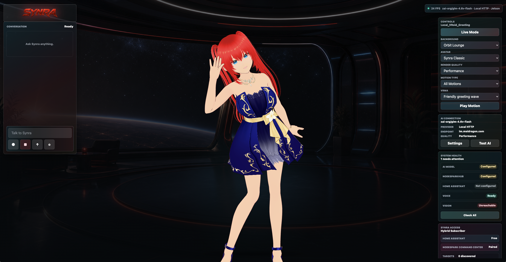
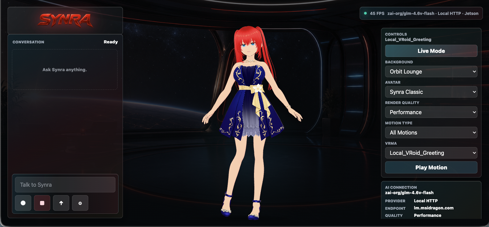
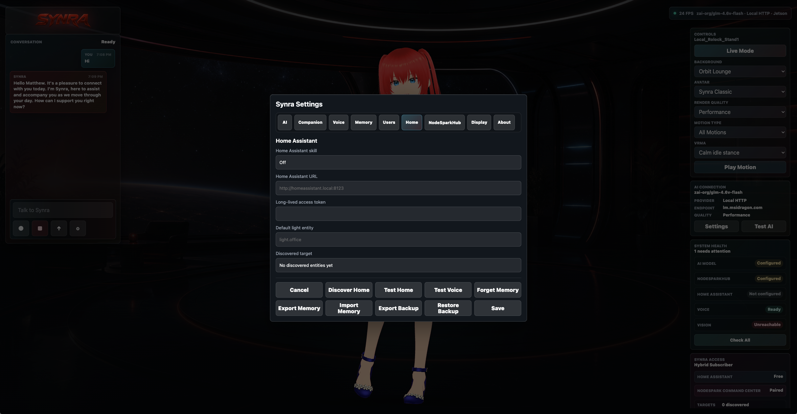

# NodeSpark Synra

[](https://synryzen.github.io/NodeSpark-Synra/)
[](CONTRIBUTING.md)
[](SECURITY.md)
[](LICENSE)



Synra Standalone is the dedicated companion path for Synra: a real-time anime AI assistant with voice, motion, memory, smart-home awareness, and optional NodeSparkHub Command Center pairing. It keeps the Synra experience from NodeSpark and NodeSparkHub, then packages it as a Jetson-first appliance-style runtime.

Star the repo if you want to follow Synra's Jetson companion roadmap. Contributions are welcome for avatar motion, lip-sync, Home Assistant safety, local model routing, UI polish, performance, privacy, and setup docs.

Synra is source-available, not open-source for resale. You may study it, run it
privately, and contribute to the original project, but you may not copy,
repackage, resell, rebrand, upload, host, or redistribute Synra or her character
assets without written permission. See [LICENSE](LICENSE),
[TRADEMARKS.md](TRADEMARKS.md), and [ASSET_POLICY.md](ASSET_POLICY.md).

<p>
  <strong>Version:</strong> 4.4.0 &nbsp;|&nbsp;
  <strong>Default avatar:</strong> Synra Classic &nbsp;|&nbsp;
  <strong>Runtime:</strong> Jetson kiosk, browser, and Electron station &nbsp;|&nbsp;
  <strong>Motion:</strong> 97 VRMA clips
</p>

## Experience

Synra is designed to feel present without losing control, privacy, or reliability:

- Speak with ElevenLabs voice output and timestamped lip-sync support.
- Use local or cloud AI models through an OpenAI-compatible server path.
- Remember user-approved preferences locally.
- Run on NVIDIA Jetson as a lean 30 FPS kiosk companion.
- Control Home Assistant tools only when configured and confirmed.
- Pair with NodeSparkHub as an optional subscriber skill, not a hard dependency.
- Keep Synra Classic installed first as the main Synra identity.

## Screenshots

| Live companion | Settings and Home Assistant |
| --- | --- |
|  |  |

| Motion and presence |
| --- |
|  |

## Current Runtime

- Vite + TypeScript frontend.
- Three.js / VRM avatar renderer.
- Three Synra avatars.
- 97 VRMA motion clips.
- Six Synra stage backgrounds.
- Python same-origin API server for Jetson deployment.
- Local model bridge, smart-home bridge, and privacy-safe camera diagnostics.
- Server-managed secrets for API keys and device tokens.
- Backup, restore, watchdog, release status, and health endpoints for appliance-style operation.

## Jetson

The Jetson deployment is documented in [docs/jetson-runbook.md](docs/jetson-runbook.md), with a quick installer in [docs/jetson-install.md](docs/jetson-install.md).

Fresh Jetson install:

```bash
curl -fsSL https://raw.githubusercontent.com/synryzen/NodeSpark-Synra/main/scripts/install-jetson.sh | bash
```

Guided install page:

```text
https://synryzen.github.io/NodeSpark-Synra/jetson-install.html
```

Default runtime:

```text
http://127.0.0.1:5191/?profile=jetson&mode=kiosk&fps=30&live=1&quality=sharp&scale=1&maxw=2560&maxh=1600&avatar=classic&telemetry=1
```

Diagnostics:

```bash
~/synra-standalone/scripts/jetson-diagnostics.sh
~/synra-standalone/scripts/kiosk-performance-check.sh
~/synra-jetson-station/scripts/electron-gpu-check.sh
```

The recommended production kiosk is the Electron shell managed by `synra-electron-kiosk.service`. Older snap Chromium kiosk autostarts are disabled during install/deploy because running both shells after reboot can make the avatar extremely slow.

After install, open `http://JETSON_IP:5191/`, go to Settings, and configure:

- `AI`: local or remote OpenAI-compatible model endpoint.
- `Companion`: owner name, local wake word, memory suggestions, and screen timeout.
- `Voice`: paste ElevenLabs API key, load voices, choose a voice, then test voice.
- `Users`: enroll known users with opt-in local face samples.
- `Home`: optional Home Assistant URL/token and default target.
- `NodeSparkHub`: optional subscriber pairing.

For easier API-key setup on the Jetson display, start Electron in windowed mode:

```bash
SYNRA_KIOSK_WINDOW_MODE=windowed ~/synra-jetson-station/scripts/start-electron-kiosk.sh
```

You can also switch anytime inside Synra from `Settings` > `Display` with the window/fullscreen button. The Electron shell remembers the last selected mode.

The Electron kiosk defaults to local mic/camera permission auto-grant for the dedicated Jetson station shell. Browser and mobile users still control permissions through their browser.

Wake word and user-recognition setup are opt-in. Synra does not save raw audio or camera frames to memory, and face samples stay local to the device profile where they are created.

## GitHub Page

Project page:

```text
https://synryzen.github.io/NodeSpark-Synra/
```

Install page:

```text
https://synryzen.github.io/NodeSpark-Synra/jetson-install.html
```

Contribute page:

```text
https://synryzen.github.io/NodeSpark-Synra/contribute.html
```

Roadmap:

```text
docs/roadmap.md
```

## Contribute

Synra welcomes focused contributions that improve reliability, beauty, performance, documentation, and platform support.

- Start here: [CONTRIBUTING.md](CONTRIBUTING.md).
- Report bugs with the GitHub bug template.
- Suggest focused enhancements with the feature request template.
- Open pull requests with screenshots for visual/avatar changes and verification output for code changes.
- Report security or privacy issues privately. See [SECURITY.md](SECURITY.md).

## License And Brand Protection

Synra, Synra Classic, NodeSpark, NodeSparkHub, logos, avatar assets, VRM/VRMA
files, screenshots, prompts, character identity, and related trade dress are
protected. The public repository is for transparency, evaluation, and
contribution to the original project. It is not permission to create a competing
assistant, resell the app, redistribute the assets, or publish a clone.

## Development

```bash
npm install
npm run typecheck
npm run build
npm run perf:smoke
```

## Product Boundary

Synra Standalone does not replace Synra inside NodeSpark. NodeSpark and NodeSparkHub remain the workflow automation products. Synra Standalone is the companion product that can later connect to NodeSpark as one optional skill.
